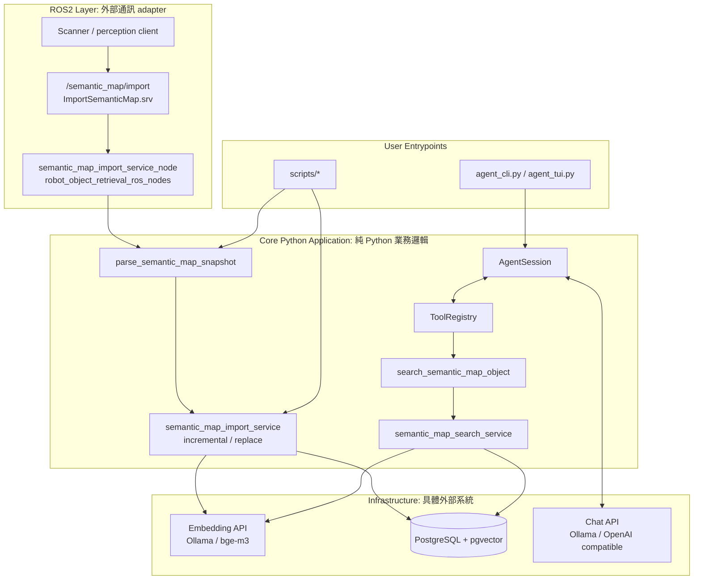
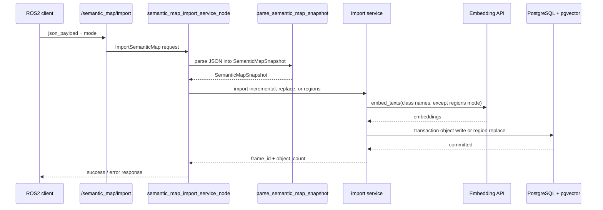
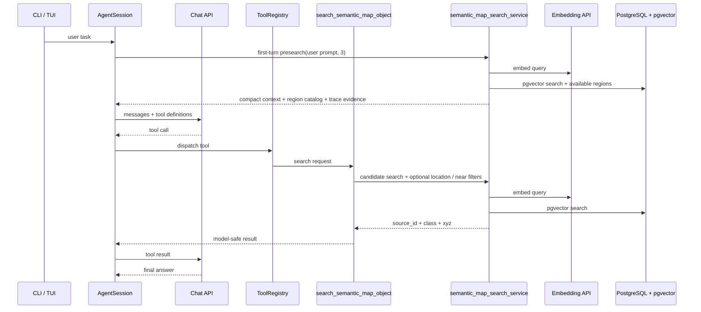
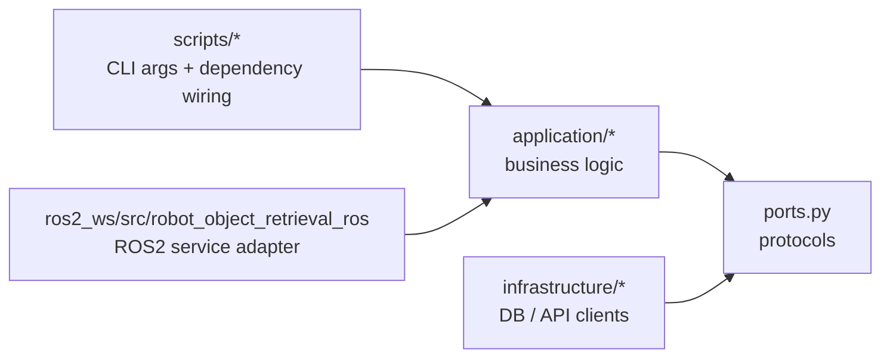

# 系統架構

這份文件描述目前可執行的架構。程式碼與測試仍是最終事實；若文件與實作衝突，以實作為準。

## 分層總覽



核心原則：ROS2 node 只做 adapter，負責接 service request、轉成 application input、回傳 response；`application/*` 不 import `rclpy`，也不依賴 ROS2 message shape。

## Semantic Map Import Flow



正式 ROS2 匯入入口：

```text
service: /semantic_map/import
type: robot_object_retrieval_ros/srv/ImportSemanticMap
request: json_payload, mode
response: success, frame_id, source_next_id, object_count, error_type, message
```

`mode` 可用 `incremental`、`replace` 或 `regions`；空字串預設為 `incremental`。

## Agent Query Flow



Agent tool 對模型暴露 `filter_status`、`match_status`、resolved location / near object 摘要，以及可信候選的 `id`、`class`、`xyz`。感知 `confidence` 與 embedding `similarity` 只保留在直接搜尋 CLI 與 debug trace，不交給小模型決策。若指定 `location` 或 `near_object_id` 無法解析，工具回空結果並標示原因，不 fallback 到全域搜尋。`scripts/search_semantic_map.py` 是同一套 search service 的 debug 入口，支援 `--location`、`--near-object-id` 與 `--near-radius-m`，並輸出完整 debug 分數。

## Python 邊界



- `scripts/*` 只做 CLI 參數解析與 dependency wiring。
- `ros2_ws/src/robot_object_retrieval_ros` 只做 ROS2 service adapter 與 `.srv` interface。
- `application/*` 放 parser、import、search、agent runtime 與 tool groups。
- `infrastructure/*` 放 PostgreSQL、pgvector、embedding API、chat API 等具體實作。

## 原則

- 外部 JSON 或 ROS2 service request 先轉成 `SemanticMapSnapshot`，核心 importer 不依賴 ROS2 shape；snapshot 可選擇包含 AABB `regions`。
- Semantic map import 的正式 ROS2 入口是 `/semantic_map/import` service，不是 topic。
- Agent tool 對外使用 ROS2 `source_id`，不暴露 DB serial id。
- 真實 robot action / human interaction tools 後續應新增到 `application/tools/`，再由 ROS2 adapter bridge 到 service/action。
- 舊 Replica SQL 位於 `archive/legacy_replica/`，不再作為可執行入口。
